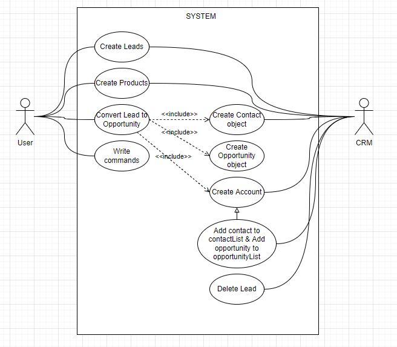
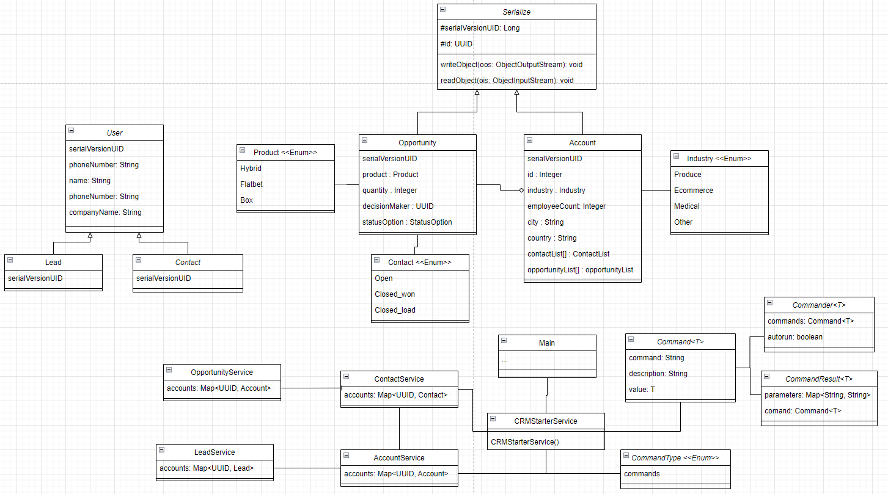

# RENUA_SW_CRM

Equipo:
Joel
Sergi
Iván

# Inicio
Este proyecto, es un CRM con el cual las empresas pueden tener el control de la creación y acceso a los clientes 
potenciales que se van generando. Todo el proyecto se controla mediante comandos que se introducen por teclado.
Los datos se guardan en una base de datos serializada en un fichero "serialized-data.txt".

Al correr el proyecto, el primer comando que se recomienda usar es "help", el cual muestra todos los comandos posibles
de ejecutar.

# Funcionamiento
Si es la primera vez que se corre el proyecto, se recomienta usar los comandos en el siguiente orden:

    new lead                - Create a new lead
    show leads              - Show all leads
    lookup lead :id         - Show a lead by id
    convert :id             - Convert a lead to a contact related with an opportunity and an account by lead id
    show contacts           - Show all contacts
    lookup contact :id      - Show a contact by id
    show opportunities      - Show all opportunities
    lookup opportunity :id  - Show an opportunity by id
    show accounts           - Show all accounts
    lookup account :id      - Show an account by id
    close-lost :id          - Close an opportunity as lost by id
    close-won :id           - Close an opportunity as won by id

De esta manera, se puede ver todo lo que está pasando desde que se crea el primer lead con "new lead".

Use Case Diagram

UML Class Diagram
