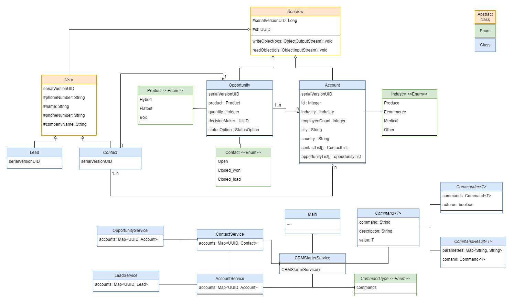
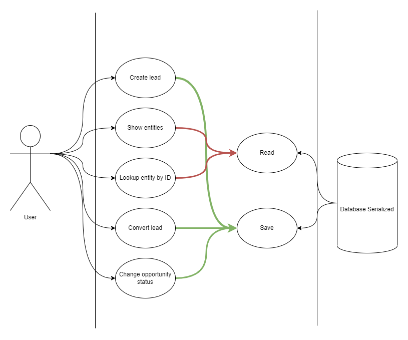

# RENUA Software CRM

### Introduction
Welcome to the RENUA Software CRM.
This is a simple CRM that allows you to manage your customers and their orders.
You can add, edit, delete and view your leads and customers.

### UML Class Diagram

### UML Use Case Diagram

### Diagram folders
- **Commander**: Use to handle the command lines.
- **Enums**: Use to handle the fixed values.
- **Model**: Use to handle the data model.
- **Serialize**: Use to handle the data serialization.
- **Service**: Use to handle the service layer.
- **UserInput**: Use to handle the user inputs from command lines.

### How to use the software
Run the software and follow the instructions.
In the command line use *help* to see the available commands.
The basic functionalities are:
- Create a new lead.
- Show all the leads, contacts, opportunities and accounts saved in the software.
- Show the details of a lead, contact, opportunity or account.
- Convert a lead to an opportunity. Then the lead is converted to a contact and the account related with the contact is also created.
- Update the status of an opportunity.